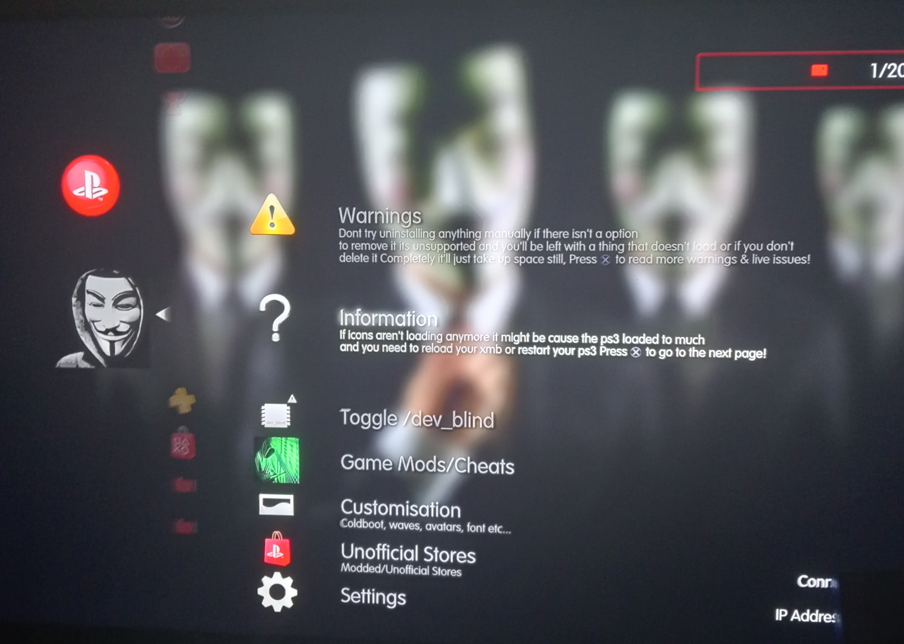
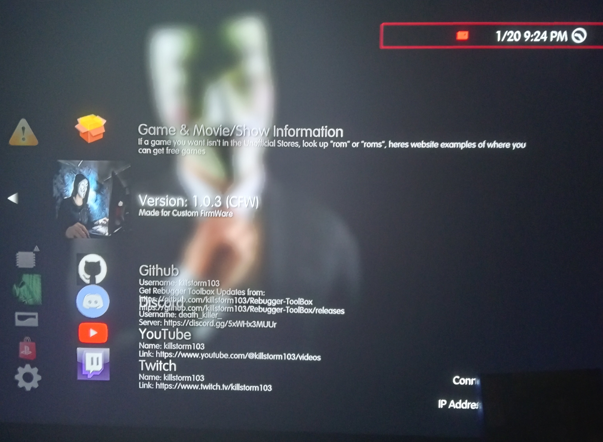
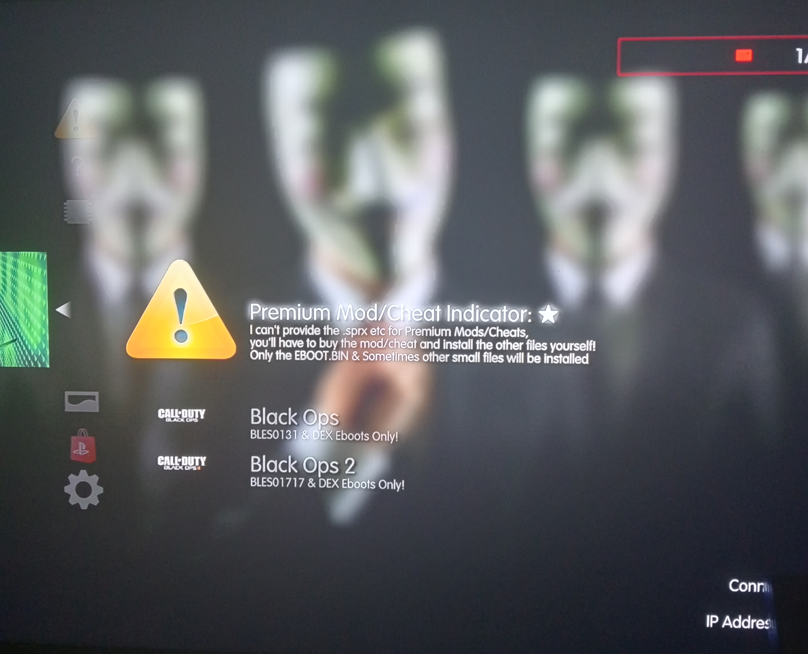
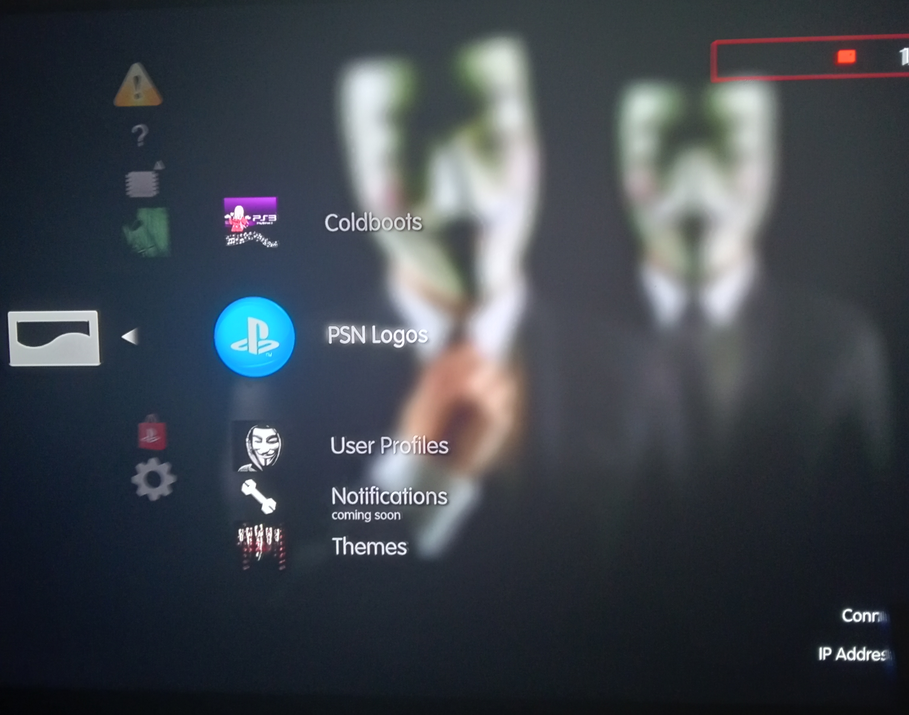
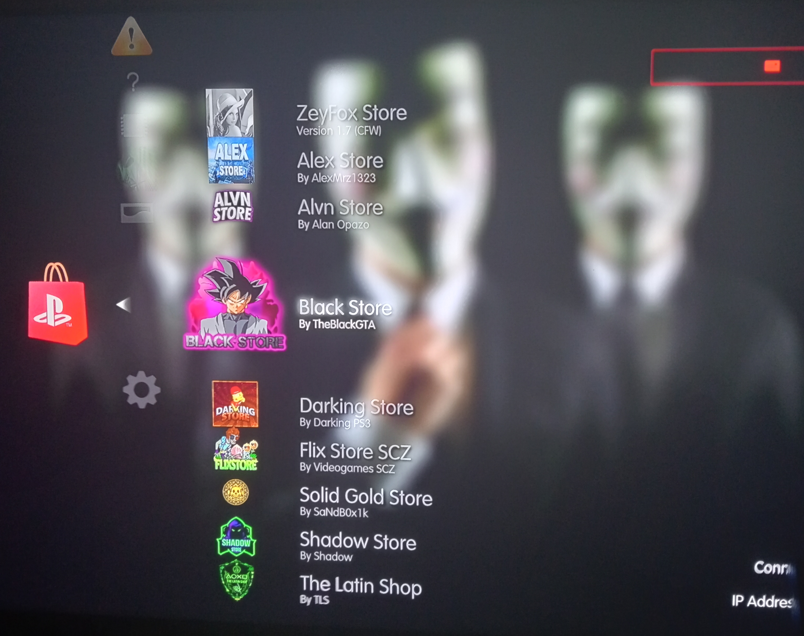

# Rebugger-ToolBox

- How to Update:
- Go into Rebugger Toolbox > Settings > Update Rebugger Toolbox > Updater > CFW (Latest Stable Or Dev Build) Download the file to /dev_hdd0/packages or /dev_hdd0/dev_usb000 (number might be different for you)
- Then if your on HEN/HFW Go into: Rebugger Toolbox > Settings > Update Rebugger Toolbox > HEN > HEN (Latest Stable Or Dev Build)
- then go to Delete Rebugger Toolbox: Rebugger Toolbox > Settings > Delete Rebugger Toolbox > Completely remove Rebugger Toolbox and press x
- Then restart your ps3 and install the new version from within your package manager
- Rebugger.Toolbox.Installer_CFW.pkg First then Rebugger.Toolbox.Patch_HEN.pkg  IF Your on HEN/HFW
-
-
- How to install: 
- Download the latest Stable or Dev Build from Releases
- Put the Installers in a USB and plug it into your ps3 or put it in your ps3's: /dev_hdd0/packages or  /dev_hdd0/dev_usb000 (number might be different for you) using FileZilla
- On your ps3 mount dev_blind (use webman mod, weMAN Games > webMAN Setup > Enable /dev_blind)
- then go to your package manager > Install Package Files > (PS3 System Storage or Standard) >:
- Install in this order: Rebugger_Toolbox_Fixes_Mount_dev_blind_First.pkg (Both files combined) or Rebugger_Toolbox_Plugin_Installer_Mount_dev_blind_First.pkg > Rebugger_Toolbox_Category_Installer_Mount_dev_blind_First.pkg
- then lastly install: Rebugger.Toolbox.Installer_CFW.pkg
- and then Rebugger.Toolbox.Patch_HEN.pkg  IF Your on HEN/HFW
- Then restart your ps3 and go to the PSN/PlayStation Network Category and then you'll see Rebugger Toolbox

- Previews:

